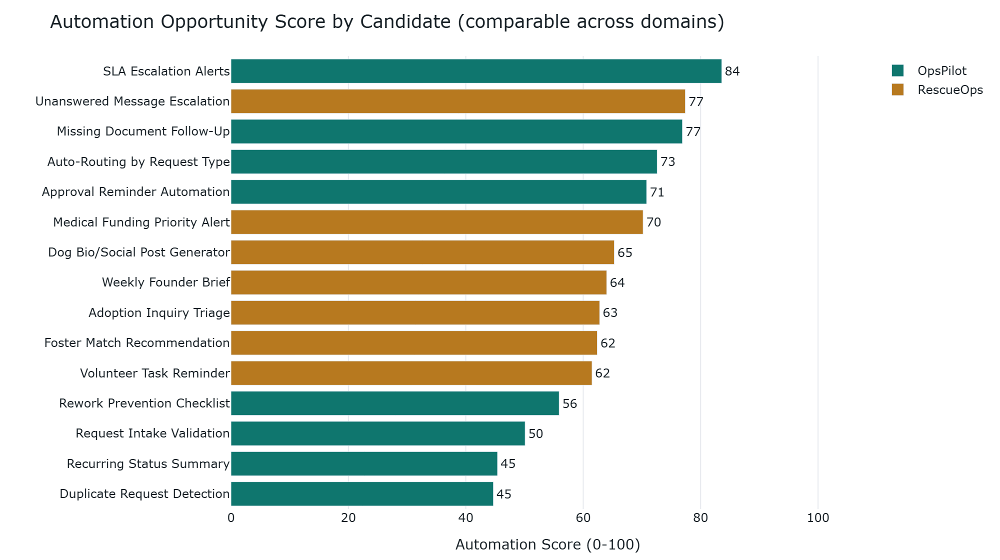

# OpsPilot Command Center

### [Live demo](https://opscommandcenter.streamlit.app/) &nbsp;|&nbsp; built with Streamlit

[](https://opscommandcenter.streamlit.app/)
[](https://github.com/CJud25/OpsCommandCenter/actions/workflows/ci.yml)

OpsPilot turns raw operational data into a ranked, ROI-backed automation roadmap -- and then acts on it -- proven across two very different operations: a business service desk and a nonprofit dog rescue.

**Find the bottleneck, price the fix, rank the work, generate the brief, run the automation** -- one framework, two domains.

Runs fully locally with no external API calls, so no data ever leaves the machine. All data is synthetic; this is a portfolio demonstration and every figure is illustrative.



**Verified:** `py -m pytest -q` runs **20 tests** (green in CI on Python 3.12 and 3.13); measured line coverage of the analytics + automation modules is **75%** (`py -m pytest --cov=modules --cov=automations`). Coverage is measured, not asserted -- the headless suite deliberately excludes the Streamlit UI layer.

### Run it in 3 commands

```bash
pip install -r requirements.txt   # runtime deps (add -r requirements-dev.txt for the test tools)
streamlit run app.py              # dashboard; generates the synthetic data on first run
python -m pytest -q               # 20 tests, ~1s, no network
```

## Analytical Integrity Review

Before shipping, every analytic in this app was put through an adversarial review. Anything that could not survive an executive's first skeptical question was removed or rebuilt. Here is what changed.

| Area | Before | After | Why it matters to a decision-maker |
| --- | --- | --- | --- |
| Bottleneck headline | Could name a stage as "primary bottleneck" that was not the largest source of delay -- the headline contradicted its own table | Stages ranked by measured delay contribution; headline and detail always agree | A wrong "fix this first" misdirects budget and headcount |
| ROI metrics | 4 headline metrics, 3 fabricated or circular: one echoed the user's own cycle-time slider back as a finding, one was an invented SLA-reduction formula with coefficients from nowhere | Those two are deleted; the labor-savings model stays and gains a real cost side -- build cost, maintenance, payback period, first-year ROI -- with an Assumptions panel and sensitivity band | A benefits number with no cost line is not an ROI; a figure that survives the CFO's first question is worth ten that do not |
| Priority and automation scores | "Analysis" re-displayed labels hardcoded into the demo-data generator | Analyzer computes scores from raw fields -- the same code works on real data | Insight must be earned from the data, not smuggled in with it |
| KPI freshness | "Last 30 days" metrics silently decayed to $0 as the committed demo data aged | KPIs anchored to the dataset's own timeline; stable on any day it is opened | A dashboard that quietly reads zero destroys trust in everything else on it |
| Opportunity score | Relative min-max normalization -- unstable, volume double-counted, not comparable across domains; a later hard ceiling then pinned most candidates to one effort value, so the ranking barely moved with the data | Absolute anchors on net monthly hours saved, through a diminishing-returns curve (no hard ceiling), so both domains share one scale and the score responds to volume -- proven by a property test | Net hours saved -- the shared, data-derived anchor -- is scored on one 0-100 curve, so both operations sit on the same scale (the impact term is domain-specific by design), and doubling the work actually changes the ranking |
| Home vs ROI savings | The home-page savings figure and the ROI page used different effective save rates, so the two views disagreed | The ROI page defaults its time-saved lever to the same blended save rate the home page uses -- the two tell one story | "Why does your dashboard say one number and your ROI page another?" is a credibility-ender |
| Severity ordering | Alphabetical sort ranked "Medium" above "Critical" | Severity-ordered | In operations, an ordering error becomes a response-time error |
| Implementation blueprints | 8 of 14 sections were identical boilerplate across every candidate | Candidate-specific plans, including idempotency and failure handling | A plan a team could actually execute, not a template |
| Dashboard to action | Insight ended at the screen | A runnable micro-automation detects missing-document requests, writes follow-ups to an outbox, and audit-logs each action with an idempotency key | Proof the system executes, not just reports |

## What Each Module Does

- `modules/scoring.py`: shared scoring primitives -- absolute automation-score anchors, SLA impact, save rates, and the dataset-anchored recency helper so the shared effort anchor (net hours saved) is scored on one comparable scale across both domains.
- `modules/classification.py`: rule-based OpsPilot candidate membership and impact aggregation from raw fields, with unique primary attribution so portfolio hours are counted once.
- `modules/data_generator.py`: generates the synthetic CSVs with realistic operational issues, emitting raw facts only (no pre-baked scores or labels).
- `modules/opspilot_analyzer.py`: OpsPilot request analytics -- summary KPIs, measured bottleneck detection by delay contribution, and chart data.
- `modules/rescueops_analyzer.py`: RescueOps analytics -- dogs, fosters, inquiries, medical priority scoring, foster matching, and the weekly founder brief.
- `modules/automation_ranker.py`: builds the cross-domain automation opportunity ranking using the absolute scoring anchors.
- `modules/roi_calculator.py`: the conservative labor-savings ROI (with a real cost/payback side) and mission-impact models behind the ROI page.
- `modules/report_generator.py`: turns analyzer output into stakeholder-ready Markdown, text, and real HTML briefs -- fully deterministic, no external calls.
- `modules/ui_components.py`: shared Streamlit UI helpers (headers, metric tiles, and layout) used across pages.
- `app.py`: the Streamlit entry point that wires the pages, demos, and downloads together.
- `automations/`: runnable micro-automations that turn dashboard insight into action -- starting with the missing-document follow-up writer.
- `tests/`: a headless pipeline smoke test, ranker/ROI property tests (including a score-stability and a volume-sensitivity proof), and micro-automation idempotency/safety tests -- run in CI on every push.

All data is synthetic and generated to be analytically honest -- scores and priorities are computed by the analyzer, never pre-baked into the data.

## What I Would Build Next

- Real data connectors (Microsoft 365, service desk, shared inbox, adoption/donation platforms) to replace the synthetic CSVs.
- Alert thresholds on the KPIs so aging, breaches, and funding gaps trigger notifications instead of waiting for someone to open the dashboard.
- Closing the micro-automation loop -- actually send the follow-ups (email/inbox integration), not just write them to an outbox.

## Demo Modes

The app includes two demo modes:

- OpsPilot: a general business operations process-improvement and automation command center. The fictional company, Summit Services Group, struggles with delayed internal requests, approval bottlenecks, missing documentation, duplicate work, and poor workload visibility.
- RescueOps: a nonprofit dog rescue operations and automation command center. The fictional rescue, Life's Paw-pose, is an all-volunteer organization managing dogs, fosters, adoption inquiries, medical needs, volunteer tasks, and donation priorities.

The goal is to show that one process-improvement framework transfers across very different operational domains -- the same analytics, scoring, and reporting code runs unchanged on both.

## Features

- Streamlit executive dashboard for two domains, with a KPI strip that leads with the four headline numbers
- Synthetic data generation on first run (seeded, reproducible)
- Measured bottleneck detection and cross-domain automation scoring on a 0-100 absolute scale, charted in-app
- Candidate-specific automation blueprints (idempotency and failure handling included)
- Conservative labor-savings ROI with a real cost side -- build cost, maintenance, payback period, and first-year ROI -- plus an Assumptions panel and a sensitivity band
- Rescue inquiry triage, foster matching, medical priority scoring, and a weekly founder brief
- Downloadable executive reports in Markdown, text, and real HTML, rendered on screen
- A runnable micro-automation that writes missing-document follow-ups and audit-logs each action, with `--dry-run` and a `--max-actions` circuit breaker
- Rule-based throughout -- no external API calls, no keys, no data egress
- Tests run in GitHub Actions CI on every push

## Tech Stack

- Python
- Streamlit
- pandas
- numpy
- Plotly
- Local CSV storage
- GitHub Actions (CI)

### Privacy note

The app is fully local and makes no network calls: no data leaves the machine, and
there are no API keys to configure. (An optional AI report-polish path was
prototyped earlier and deliberately removed from the shipped app, so the report
pipeline stays fully deterministic and auditable -- a report that could silently
alter its own numbers has no place in an integrity-first tool.) A production
deployment on real data would add encrypted storage and access controls before
writing any personal information to disk (for example the follow-up messages the
sample automation produces).

### Tested Versions

- Developed on Python 3.14 with Streamlit 1.58, pandas 3.0, numpy 2.5, plotly 6.8
- CI validates the pinned dependency ranges on Python 3.12 and 3.13 (which resolve pandas 2.3.x); the same test suite passes on all three

## How To Run Locally

```bash
pip install -r requirements.txt
streamlit run app.py
```

The app generates all required CSV files automatically in the `data/` folder on first run. To regenerate the synthetic data at any time, run:

```bash
python -m modules.data_generator --force
```

Generation is deterministic (fixed seed and anchor date), so a regenerated dataset matches the committed one byte for byte. On Windows you can substitute the `py` launcher for `python` in any command below.

## Run the Tests

The suite is standard pytest. From the repo root:

```bash
pip install -r requirements-dev.txt   # pytest, pytest-cov, ruff
python -m pytest -q                    # all 20 tests
python -m pytest --cov=modules --cov=automations --cov-report=term-missing
```

The three source files still run directly as scripts (`python tests/test_ranker.py`)
for a quick check without pytest installed:

```bash
python tests/smoke.py            # headless end-to-end pipeline
python tests/test_ranker.py      # ranker + ROI property tests
python tests/test_automation.py  # micro-automation idempotency + safety
```

These are the same checks GitHub Actions runs on every push (see the CI badge above).

## Run the Micro-Automation

From the project root:

```bash
python automations/missing_document_followup.py
python automations/missing_document_followup.py --dry-run       # preview without writing
python automations/missing_document_followup.py --max-actions 5 # circuit breaker
```

It scans `data/opspilot_requests.csv`, writes one follow-up message per missing-document request into `outbox/`, and appends an action row to `audit_log.csv`. Each action carries an idempotency key (request id plus rule name), and the audit row is written immediately after each file, so re-running it creates zero new files and zero new audit rows even if a previous run was interrupted. `--window-days N` allows a request to be chased again once its last follow-up is older than N days (a reminder ladder). Use `--help` for all options.

## Folder Structure

```text
opspilot-command-center/
|-- app.py
|-- requirements.txt
|-- README.md
|-- CONTRACTS.md
|-- CHANGES.md
|-- LICENSE
|-- .github/
|   `-- workflows/
|       `-- ci.yml
|-- .devcontainer/
|   `-- devcontainer.json
|-- .streamlit/
|   `-- config.toml
|-- docs/
|   `-- DEMO_SCRIPT.md
|-- data/
|   |-- opspilot_requests.csv
|   |-- rescueops_dogs.csv
|   |-- rescueops_inquiries.csv
|   |-- rescueops_volunteers.csv
|   `-- rescueops_medical_costs.csv
|-- assets/
|   `-- ranker.png
|-- automations/
|   `-- missing_document_followup.py
|-- tests/
|   |-- smoke.py
|   |-- test_ranker.py
|   `-- test_automation.py
`-- modules/
    |-- scoring.py
    |-- classification.py
    |-- data_generator.py
    |-- opspilot_analyzer.py
    |-- rescueops_analyzer.py
    |-- automation_ranker.py
    |-- roi_calculator.py
    |-- report_generator.py
    `-- ui_components.py
```

## Synthetic Data Explanation

All data is synthetic and generated locally. The generated records intentionally include realistic operational issues: delayed approvals, missing documentation, duplicate requests, rework, SLA breaches, overloaded departments, foster gaps, unanswered rescue inquiries, urgent medical cases, unfunded medical expenses, and limited volunteer capacity.

No real customer, employee, volunteer, donor, applicant, or animal rescue data is included.

## Disclaimer

This project uses synthetic and mock data for portfolio demonstration purposes. ROI, savings, and mission-impact estimates are illustrative and should be validated with real operational data before business use. [`docs/calibration.md`](docs/calibration.md) lists the exact real-world fields and historical baselines each ROI input needs before any figure here can be trusted for a budget decision.

## License

Released under the MIT License. See [LICENSE](LICENSE). Copyright (c) 2026 Chris Judkins.
